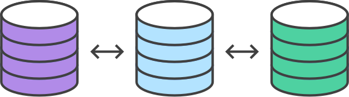

# Comparing Workflows

The array of possible workflows can make it hard to know where to begin when implementing Git in the workplace. 

This page provides a starting point by surveying the most common Git workflows for enterprise teams. 

Большое количество всевозможных рабочих процессов, может усложнить выбор возможной реализации Git. 

Эта страница предоставляет начальную точку исследуя наиболее часто встречающиеся рабочие процессы Git для команды.

As you read through, remember that these workflows are designed to be guidelines rather than concrete rules. We want to show you what’s possible, so you can mix and match aspects from different workflows to suit your individual needs.

## Централизованный рабочий процесс
	
Переход к распределенной системе контроля версий может показаться сложной задачей, но Вы не должны изменять ваш существующий рабочий процесс, чтобы начать пользоваться преимуществами Git. Ваша команда может разрабатывать проекты точно так же, как они делают это с Subversion.
	Однако, использование Git для повышения возможностей вашего рабочего процесса предоставляют несколько преимуществ по сравнению с SVN. Во-первых, он дает каждому разработчику свою собственную локальную копию всего проекта. Эта изолированная среда позволяет каждому разработчику работать независимо от других изменений в проекте—они могут добавлять коммиты в свой локальный репозиторий и совершенно забыть об upstream разработке, пока это удобно.
	Во-вторых, это дает вам доступ к надежной модели ветвления и слияния в Git. В отличие от SVN, ветки Git разработаны как отказоустойчивый механизм для объединения кода и обмена изменений между репозиториями.
	
### Как это работает
		Как и Subversion, централизованный рабочий процесс использует центральное хранилище, чтобы выступать в качестве единой точки входа для всех изменений в проекте. Вместо trunk,  дефолтная ветка разработки называется master и все изменения фиксируются в эту ветку. Этот процесс не требует никаких других веток, кроме master.
		Разработчики начинают с клонирования центрального репозитория. В своей локальной копии проекта, они редактируют файлы и делают коммиты, также как делали в SVN; однако эти новые коммиты хранятся локально—они полностью изолированы от центрального репозитория. Это позволяет разработчикам отложить восходящую синхронизацию до удобного момента.
		Чтобы опубликовать изменения в официальный проект, разработчики “пушат” свою локальную ветку master в центральный репозиторий. Это эквивалентно svn commit, за исключением того, что добавляются все локальные коммиты, которые еще не находятся в центральной ветке master.
		
		
		
		Управление Конфликтами
		
		Центральное хранилище представляет собой официальный проект, поэтому его историю коммитов следует рассматривать как священное и неизменное. Если локальные коммиты разработчика отличаются от центрального репозитория, Git отклонит пуш этих изменений, потому что это может привести к перезаписи официальных коммитов.
		
		
		
		Прежде чем разработчик сможет опубликовать свои изменения, они должны извлечь(fetch) обновленные центральные коммиты и перебазировать(rebase) свои изменения поверх них. Это все равно что сказать: “я хочу добавить мои изменения в то, что все остальные уже сдели”. В результате появится совершенно линейная история, в традициях рабочих процессов SVN.
		Если локальные изменения напрямую конфликтуют с вышележащими коммитами, Git приостановит процесс перебазирования(rebasing) и дать вам шанс вручную разрешить конфликты. Достоинство Git заключается в том, что он использует те же команды git status и git add, как для генерации коммитов, так и для разрешения конфликтов слияния. Это облегчает новым разработчикам управление собственными слияниями(merges). Плюс, если они попадают в беду, с Git можно легко прервать весь процесс rebase и попробовать снова (или найди помощь).
		
		- Пример
		Давайте шаг за шагом рассмотрим как типичная небольшая команда будет сотрудничать используя этот процесс. Мы увидим, как два разработчика, Джон и Мэри, могут работать над отдельным функционалом и обмениваться своими изменениями через централизованный репозиторий.
		Кто-то инициализирует центральный репозиторий
		
		
		
		Во-первых, кто-то должен создать центральный репозиторий на сервере. Если это новый проект, вы можете инициализировать пустой репозиторий. В противном случае, вам необходимо импортировать существующий Git или SVN репозиторий.
		Центральные репозитории всегда должны быть пустыми репозиториями (они не должны иметь рабочий каталог), и могут быть созданы следующим образом:
		ssh user@host git init --bare /path/to/repo.git
		Обязательно используйте действительное имя пользователя SSH для user, домен или IP-адрес сервера для host, и расположение, где вы хотели бы сохранить свой репозиторий для /path/to/repo.git. Обратите внимание, что расширение .git по умолчанию добавляется к имени репозитория, чтобы указать, что это «пустой» репозиторий.
		Все клонируют центральный репозиторий
		
		
		Далее каждый разработчик создает локальную копию всего проекта. Это осуществляется с помощью команды git clone:
		git clone ssh://user@host/path/to/repo.git
		Когда вы клонируете репозиторий, Git автоматически добавляет ярлык origin, который ссылается обратно на “родительский” репозиторий, при условии, что вы хотите взаимодействовать с ним в дальнейшем.
		Джон работает над своим функционалом
		
		
		
		
		В своем локальном репозитории, Джон может разрабатывать функционал используя стандартный процесс Git: edit, stage, и commit. Если Вы не знакомы с промежуточной зоной(staging area) - это способ подготовить коммит без добавления всех изменений сделанных в рабочем каталоге. Это позволяет создавать узкоспециализированные коммиты, даже если вы сделали много локальных изменений.
		git status # View the state of the repo
		git add <some-file> # Stage a file
		git commit # Commit a file</some-file>
		
		Помните, что, поскольку эти команды создают локальные коммиты, Джон можете повторять этот процесс столько раз, сколько он хочет, не беспокоясь о том, что происходит в Центральном репозитории. Это может быть очень полезно для большого функционала, который необходимо разбить на более простые, более атомарные блоки.
		Мери работает над своим функционалом
		
		
		
		Между тем, Мария работает над своим собственным функционалом в своем локальном репозитории, используя тот же процесс edit/stage/commit. Как и Джона, её не волнует, что творится в центральном репозитории, и её действительно не волнует, что делает Джон в своем локальном репозитории, так как все локальные репозитории являются приватными.
		Джон публикует свои изменения
		
		
		
		
		Когда Джон заканчивает свой функционал, он должен опубликовать локальные коммиты в центральный репозиторий, чтобы другие члены команды могли получить к нему доступ. Он может сделать это с помощью команды git push:
		git push origin master
		
		Помните, что origin - это удаленное подключение к центральному репозиторию, которое создает Git, когда Джон клонирует его. Параметр master просит Git, попытаться сделать ветку origin’s master похожей на локальную ветку master. Поскольку центральный репозиторий не обновлялся с тех пор как Джон склонировал его, это не приведет к конфликтам и push сработает, как ожидалось.
		Мэри пытается опубликовать свои изменения
		
		
		
		
		Давайте посмотрим, что произойдет, если Мэри попытается запушить свои изменения после того, как Джон успешно опубликовал свои изменения в центральный репозиторий. Она может использовать ту же команду push:
		git push origin master
		
		But, since her local history has diverged from the central repository, Git will refuse the request with a rather verbose error message:
		Но, поскольку её локальная история отличается от центрального репозитория, Git откажет в просьбе с довольно подробным сообщением об ошибке:
		error: failed to push some refs to '/path/to/repo.git'
		hint: Updates were rejected because the tip of your current branch is behind
		hint: its remote counterpart. Merge the remote changes (e.g. 'git pull')
		hint: before pushing again.
		hint: See the 'Note about fast-forwards' in 'git push --help' for details.
		
		Это предотвратит Мэри от перезаписи официальных коммитов. Она должна забрать(pull) обновления Джона в свой репозиторий, объединить их со своими локальными изменениями, и повторить попытку.
		Мэри перезаписывает(rebase) коммиты Джона 
		Mary rebases on top of John’s commit(s)
		
		
		
		
		
		This command is sort of like svn update—it pulls the entire upstream commit history into Mary’s local repository and tries to integrate it with her local commits:
		Мэри может использовать git pull, чтобы включить вышележащие изменения в свой репозиторий. Эта команда как svn update собирает всю историю коммитов в локальный репозиторий Марии и пытается объединить их со своими локальными коммитами:
		git pull --rebase origin master
		
		The --rebase option tells Git to move all of Mary’s commits to the tip of the master branch after synchronising it with the changes from the central repository, as shown below:
		Параметр --rebase предписывает Git  переместить все коммиты Марии на вершину ветви master после синхронизации их с изменениями из центрального репозитория, как показано ниже:
		
		
		Pull будет по-прежнему работать, если вы забудете этот параметр, но вам понадобится лишний “merge commit” каждый раз, когда кому-то нужно будет синхронизироваться с центральным репозиторием. Для этого рабочего процесса, всегда лучше делать rebase вместо создания merge commit.
		Мэри устраняет конфликт слияния
		
		
		
		Перебазирование(rebasing) работает путем передачи каждого локального коммита в обновленную ветку master -один коммит за один раз. Это означает, что вы перехватываете конфликты слияния коммит за коммитом, а не устраняете их все в одном массивном merge  коммите. Это помогает сохранять ваши коммиты максимально сфокусированными и создает чистую историю проекта. В последующем, это позволяет гораздо проще выяснить, где были внедрены ошибки и, при необходимости, откатить изменения с минимальными последствиями для проекта.
		Если Мэри и Джон работают над несвязанным функционалом, маловероятно, что процесс перебазирования будет порождать конфликты. Но если это так, то Git приостановит перебазирование на текущем коммите и выведет следующее сообщение, вместе с некоторыми важными инструкциями:
		CONFLICT (content): Merge conflict in <some-file>
		
		
		
		Большим преимуществом Git является то, что любой может разрешить свои конфликты слияния. В нашем примере, Мэри может просто запустить git status, чтобы увидеть, где проблема. Конфликтующие файлы отобразятся в разделе Unmerged paths:
		# Unmerged paths:
		# (use "git reset HEAD <some-file>..." to unstage)
		# (use "git add/rm <some-file>..." as appropriate to mark resolution)
		#
		# both modified: <some-file>
		
		Затем, она отредактирует файл(ы) по своему усмотрению. Как только результат её удовлетворит, она может добавить файл(ы) в обычном порядке, и пусть git rebase сделает все остальное:
		git add <some-file>
		git rebase --continue
		
		И это все, что можно сказать. Git перейдет к следующему коммиту и повторит процесс для любых других коммитов, которые вызывают конфликты.
		Если Вы дошли до этого момента и осознаёте, что не представляете, что происходит, не паникуйте. Просто выполните следующую команду и вы вернетесь туда, где вы начинали перед запуском git pull --rebase:
		git rebase --abort
		
		Мэри успешно публикует свои изменения
		
		
		
		
		После того, как Мэри сделала синхронизацию с центральным репозиторием, она сможет успешно опубликовать свои изменения:
		git push origin master
		
		
		
		- Куда Идти Отсюда
		Как видите, вполне возможно повторить традиционную среду разработки Subversion, используя только несколько команд Git. Это отличная возможность для перехода команды из SVN, но этот подход не использует распределенный характер Git.
		Если вашей команде комфортно использовать централизованный рабочий процесс, но она хочет рационализировать сотрудничество, определенно стоит изучить преимущества Feature Branch Workflow. Путем выделения обособленной ветки для каждого функционала, возможно начать углубленные дискуссии вокруг новых дополнений до их интеграции в официальный проект.
	- Feature Branch Workflow
	
	
	Как только вы получили навык централизованного рабочего процесса, добавление ветвления в процесс разработки является простым способом поощрить сотрудничество и упростить коммуникацию между разработчиками.
	Основной идеей рабочего процесса Feature Branch является то, что вся разработка функционала должна происходить в выделенной ветке, а не в ветке master. Это инкапсуляция облегчает нескольким разработчикам работу над конкретным функционалом без нарушения основной кодовой базы. Это также означает, что ветка master не будет содержать испорченный код, что является огромным преимуществом для среды непрерывной интеграции.
	Инкапсуляция функционала также позволяет использовать pull requests, которые являются способом инициировать обсуждение ветки. Они дают другим разработчикам возможность утвердить функционал, прежде чем он интегрируется в официальный проект. Или, если вы застряли в середине объекта, вы можете открыть pull request с просьбой помощи у своих коллег. Смысл в том, что pull requests невероятно облегчают команде комментирование работ друг друга.
	
		- Как это работает
		В рабочем процессе Feature Branch также используется центральный репозиторий, и master по-прежнему представляет официальную историю проекта. Но, вместо того, чтобы делать коммиты непосредственно в локальную ветку master, разработчики создают новую ветку каждый раз, когда они начинают работу над новой функцией. Ветки Feature должны иметь описательные имена, такие как animated-menu-items или issue-#1061. Идея в том, чтобы назначить четкие, узконаправленные задачи для каждой ветви.
		Git не делает никаких технических различий между веткой master и ветками feature, так что разработчики могут редактировать, добавлять(stage), и коммитить изменения в ветку feature  так же, как они делали это в централизованном рабочем процессе.
		Кроме того,  ветки feature  могут (и должны) быть «запушены» в центральный репозиторий. Это дает возможность делиться изменениями с другими разработчиками, не касаясь официального кода. Поскольку master - это только “специальная” ветка, хранение несколько веток в центральном реппозитории не представляет никакой проблемы. Конечно, это также удобный способ для резервного копирования локальных коммитов всех членов команды.
		Pull Requests
		
		Помимо изолирования разработки функционала, ветки позволяют обсуждать изменения через pull requests. Как только кто-то завершает разработку функционала, они не сразу сливают его в master. Вместо этого они «пушат» ветку feature на центральный сервер и подают pull request с просьбой объединить их изменения в master. Это дает другим разработчикам возможность просмотреть изменения, прежде чем они становятся частью основного кода.
		Код ревью является основным преимуществом pull request, но они на самом деле являются универсальным способом обсуждать код. Вы можете думать о pull requests, как о дискуссии, посвященной конкретной ветке. Это означает, что они могут также использоваться на более ранних этапах разработки. Например, если разработчику нужна помощь в определенных ситуациях, все что он должен сделать, это подать pull request. Заинтересованные стороны будут уведомлены автоматически, и у них будет возможность видеть вопрос рядом с соответствующими коммитами.
		Когда pull reques принят, сам акт публикации изменений является таким же, как и в централизованном рабочем процессе. Во-первых, вы должны убедиться, что ваш локальный master синхронизирован с upstream master. Затем слить ветку в master и запушить обновленный master обратно в центральный репозиторий.
		Pull requests can be facilitated by product repository management solutions like Bitbucket Cloud or Bitbucket Server. View the Bitbucket Server pull requests documentation for an example.
		Pull requests могут способствовать решения для управления репозиториями продуктов, такие как Bitbucket Cloud или Bitbucket Server. Просмотрите для примера Bitbucket Server pull requests documentation.
		
		- Пример
		Пример ниже демонстрирует pull request в качестве проверки кода, но помните, что он может служить для многих других целей.
		Мэри начинает разрабатывать новый функционал
		
		
		
		Прежде чем Мэри начнет разрабатывать функционал, для работы ей необходима изолированная ветка. Она может создать новую ветку с помощью следующей команды:
		git checkout -b marys-feature master
		
		Этот код переключит на ветку под названием marys-feature, основанную на master, а флаг -b предписывает Git создать ветку если она еще не существует. На этой ветке, Мэри изменяет, добавляет и коммитит обычным способом, создавая свой функционал делая все необходимые коммиты:
		git status
		git add <some-file>
		git commit
		
		Мэри уходит на обед
		
		
		
		Мэри добавляет несколько коммитов в свой код в течение утра. Прежде чем она уйдет на обед, хорошо бы запушить все её изменения в центральный репозиторий. Это служит в качестве удобного резервного копирования, и если Мария сотрудничает с другими разработчиками, это также может дать им доступ к её первоначальным коммитам.
		git push -u origin marys-feature
		
		Эта команда пушит ветку marys-feature в центральный репозиторий (origin), а флаг -u добавляет её как удаленно отслеживаемую ветку(remote tracking branch). После настройки отслеживаемой ветки, Мэри может вызвать git push без каких-либо параметров, чтобы запушить свои изменения.
		Мэри заканчивает разработку
		
		
		
		When Mary gets back from lunch, she completes her feature. Before merging it into master, she needs to file a pull request letting the rest of the team know she's done. But first, she should make sure the central repository has her most recent commits:
		Когда Мэри вернулась с обеда, она завершает разработку. Перед тем как слить изменения в master, она должна подать pull request, позволяя остальной команде узнать, что она закончила вносить изменения. Но сначала она должна убедиться, что центральный репозиторий содержит её самые последние изменения:
		git push
		
		Затем, она подаст pull request в своем Git GUI с просьбой объединить marys-feature с master, и члены команды будут автоматически уведомлены. Большим преимуществом pull request является то, что они показывают комментарии рядом с коммитами, к которым они относятся, поэтому легко задавать вопросы о конкретных правках.
		Билл получает pull request
		
		
		
		Bill gets the pull request and takes a look at marys-feature. He decides he wants to make a few changes before integrating it into the official project, and he and Mary have some back-and-forth via the pull request.
		Билл получает pull request и просматривает ветку marys-feature. Он решает, что он хочет сделать несколько изменений, прежде чем включить её в официальный проект, и они с Мэри немного дискутируют через pull request.
		Mary makes the changes
		
		
		
		
		To make the changes, Mary uses the exact same process as she did to create the first iteration of her feature. She edits, stages, commits, and pushes updates to the central repository. All her activity shows up in the pull request, and Bill can still make comments along the way.
		If he wanted, Bill could pull marys-feature into his local repository and work on it on his own. Any commits he added would also show up in the pull request.
		Mary publishes her feature
		
		
		
		
		Once Bill is ready to accept the pull request, someone needs to merge the feature into the stable project (this can be done by either Bill or Mary):
		git checkout master
		git pull
		git pull origin marys-feature
		git push
		First, whoever’s performing the merge needs to check out their master branch and make sure it’s up to date. Then, git pull origin marys-feature merges the central repository’s copy of marys-feature. You could also use a simple git merge marys-feature, but the command shown above makes sure you’re always pulling the most up-to-date version of the feature branch. Finally, the updated master needs to get pushed back to origin.
		This process often results in a merge commit. Some developers like this because it’s like a symbolic joining of the feature with the rest of the code base. But, if you’re partial to a linear history, it’s possible to rebase the feature onto the tip of master before executing the merge, resulting in a fast-forward merge.
		Some GUI’s will automate the pull request acceptance process by running all of these commands just by clicking an “Accept” button. If yours doesn’t, it should at least be able to automatically close the pull request when the feature branch gets merged into master
		Meanwhile, John is doing the exact same thing
		
		While Mary and Bill are working on marys-feature and discussing it in her pull request, John is doing the exact same thing with his own feature branch. By isolating features into separate branches, everybody can work independently, yet it’s still trivial to share changes with other developers when necessary.
		
		- Where To Go From Here
		For a walkthrough of feature branching on Bitbucket, check out the Using Git Branches documentation. By now, you can hopefully see how feature branches are a way to quite literally multiply the functionality of the single master branch used in the Centralized Workflow. In addition, feature branches also facilitate pull requests, which makes it possible to discuss specific commits right inside of your version control GUI.
		The Feature Branch Workflow is an incredibly flexible way to develop a project. The problem is, sometimes it’s too flexible. For larger teams, it’s often beneficial to assign more specific roles to different branches. The Gitflow Workflow is a common pattern for managing feature development, release preparation, and maintenance.
		
	* Gitflow Workflow
	
	
	Рабочий процесс Gitflow заимствован у Vincent Driessen из nvie.
	The Gitflow Workflow defines a strict branching model designed around the project release. 
	Рабочий процесс Gitflow определяет строгую модель ветвления расчитанную вокруг выпуска проекта. Хотя он несколько сложнее, чем Feature Branch Workflow, он обеспечивает прочную основу для управления крупными проектами.
	This workflow doesn’t add any new concepts or commands beyond what’s required for the Feature Branch Workflow. Instead, it assigns very specific roles to different branches and defines how and when they should interact. In addition to feature branches, it uses individual branches for preparing, maintaining, and recording releases. Of course, you also get to leverage all the benefits of the Feature Branch Workflow: pull requests, isolated experiments, and more efficient collaboration.
	Этот процесс не добавить каких-либо новых концепций или команд к тому, что требуется для рабочего процесса Feature Branch. Вместо этого он присваивает очень конкретные роли для разных отраслей и определяет, как и когда они должны взаимодействовать. Помимо feature branches, он использует отдельные ветки для подготовки, поддержания и записи релизов. Конечно, вы также добираетесь, чтобы использовать все преимущества функции отделения документооборот: запросы, изолированные эксперименты, а также более эффективное сотрудничество.
	
	
	- Разветвленный рабочий процесс (Forking Workflow)
	Разветвленный рабочий процесс принципиально отличается от других процессов обсуждаемых в данном руководстве. Вместо того, чтобы использовать один серверный репозиторий в качестве “центральной” базы кода, это дает каждому разработчику серверное хранилище. Это означает, что каждый участник имеет не один, а два git-репозитория: частный локальный и публичный серверный.
	
	
	The main advantage of the Forking Workflow is that contributions can be integrated without the need for everybody to push to a single central repository. Developers push to their own server-side repositories, and only the project maintainer can push to the official repository. This allows the maintainer to accept commits from any developer without giving them write access to the official codebase. 
	Основное преимущество Разветвленного процесса заключается в том, что вклады могут быть интегрированы без необходимости для всех пушить в единое хранилище. Разработчики пушат в собственные серверные хранилища, и только сопровождающий проект может пушить в официальный репозиторий. Это позволяет разработчику принять комиты от любого разработчика, не давая им доступ на запись в официальном коде.
	The result is a distributed workflow that provides a flexible way for large, organic teams (including untrusted third-parties) to collaborate securely. This also makes it an ideal workflow for open source projects.
	
		- Как это работает
		
		As in the other Git workflows, the Forking Workflow begins with an official public repository stored on a server. But when a new developer wants to start working on the project, they do not directly clone the official repository.
		Instead, they fork the official repository to create a copy of it on the server. This new copy serves as their personal public repository—no other developers are allowed to push to it, but they can pull changes from it (we’ll see why this is important in a moment). After they have created their server-side copy, the developer performs a git clone to get a copy of it onto their local machine. This serves as their private development environment, just like in the other workflows.
		When they're ready to publish a local commit, they push the commit to their own public repository—not the official one. Then, they file a pull request with the main repository, which lets the project maintainer know that an update is ready to be integrated. The pull request also serves as a convenient discussion thread if there are issues with the contributed code.
		To integrate the feature into the official codebase, the maintainer pulls the contributor’s changes into their local repository, checks to make sure it doesn’t break the project, merges it into his local master branch, then pushes the master branch to the official repository on the server. The contribution is now part of the project, and other developers should pull from the official repository to synchronize their local repositories.
		The Official Repository
		
		It’s important to understand that the notion of an “official” repository in the Forking Workflow is merely a convention. From a technical standpoint, Git doesn’t see any difference between each developer’s public repository and the official one. In fact, the only thing that makes the official repository so official is that it’s the public repository of the project maintainer.
		Branching in the Forking Workflow
		
		All of these personal public repositories are really just a convenient way to share branches with other developers. Everybody should still be using branches to isolate individual features, just like in the Feature Branch Workflow and the Gitflow Workflow. The only difference is how those branches get shared. In the Forking Workflow, they are pulled into another developer’s local repository, while in the Feature Branch and Gitflow Workflows they are pushed to the official repository.
		
		- Example
		The project maintainer initializes the official repository
		
		
		
		
		As with any Git-based project, the first step is to create an official repository on a server accessible to all of the team members. Typically, this repository will also serve as the public repository of the project maintainer.
		Public repositories should always be bare, regardless of whether they represent the official codebase or not. So, the project maintainer should run something like the following to set up the official repository:
		ssh user@host
		git init --bare /path/to/repo.git
		Bitbucket also provides a convenient GUI alternative to the above commands. This is the exact same process as setting up a central repository for the other workflows in this tutorial. The maintainer should also push the existing codebase to this repository, if necessary.
		Developers fork the official repository
		
		
		
		
		Next, all of the other developers need to fork this official repository. It’s possible to do this by SSH’ing into the server and running git clone to copy it to another location on the server—yes, forking is basically just a server-side clone. But again, Bitbucket let developers fork a repository with the click of a button.
		After this step, every developer should have their own server-side repository. Like the official repository, all of these should be bare repositories.
		Developers clone their forked repositories
		
		
		
		
		Next each developer needs to clone their own public repository. They can do with the familiar git clone command.
		Our example assumes the use of Bitbucket to host these repositories. Remember, in this situation, each developer should have their own Bitbucket account and they should clone their server-side repository using:
		git clone https://user@bitbucket.org/user/repo.git
		Whereas the other workflows in this tutorial use a single origin remote that points to the central repository, the Forking Workflow requires two remotes—one for the official repository, and one for the developer’s personal server-side repository. While you can call these remotes anything you want, a common convention is to use origin as the remote for your forked repository (this will be created automatically when you run git clone) and upstream for the official repository.
		git remote add upstream https://bitbucket.org/maintainer/repo
		You’ll need to create the upstream remote yourself using the above command. This will let you easily keep your local repository up-to-date as the official project progresses. Note that if your upstream repository has authentication enabled (i.e., it's not open source), you'll need to supply a username, like so:
		git remote add upstream https://user@bitbucket.org/maintainer/repo.git
		This requires users to supply a valid password before cloning or pulling from the official codebase.
		Developers work on their features
		
		
		
		
		In the local repositories that they just cloned, developers can edit code, commit changes, and create branches just like they did in the other workflows:
		git checkout -b some-feature
		# Edit some code
		git commit -a -m "Add first draft of some feature"
		All of their changes will be entirely private until they push it to their public repository. And, if the official project has moved forward, they can access new commits with git pull:
		git pull upstream master
		Since developers should be working in a dedicated feature branch, this should generally result in a fast-forward merge.
		Developers publish their features
		
		
		
		
		Once a developer is ready to share their new feature, they need to do two things. First, they have to make their contribution accessible to other developers by pushing it to their public repository. Their origin remote should already be set up, so all they should have to do is the following:
		git push origin feature-branch
		This diverges from the other workflows in that the origin remote points to the developer’s personal server-side repository, not the main codebase.
		Second, they need to notify the project maintainer that they want to merge their feature into the official codebase. Bitbucket provides a “Pull request” button that leads to a form asking you to specify which branch you want to merge into the official repository. Typically, you’ll want to integrate your feature branch into the upstream remote’s master branch.
		The project maintainer integrates their features
		
		
		
		
		When the project maintainer receives the pull request, their job is to decide whether or not to integrate it into the official codebase. They can do this in one of two ways:
			1.	Inspect the code directly in the pull request
		
			2.	Pull the code into their local repository and manually merge it
		
		The first option is simpler, as it lets the maintainer view a diff of the changes, comment on it, and perform the merge via a graphical user interface. However, the second option is necessary if the pull request results in a merge conflict. In this case, the maintainer needs to fetch the feature branch from the developer’s server-side repository, merge it into their local master branch, and resolve any conflicts:
		git fetch https://bitbucket.org/user/repo feature-branch
		# Inspect the changes
		git checkout master
		git merge FETCH_HEAD
		Once the changes are integrated into their local master, the maintainer needs to push it to the official repository on the server so that other developers can access it:
		git push origin master
		Remember that the maintainer's origin points to their public repository, which also serves as the official codebase for the project. The developer's contribution is now fully integrated into the project.
		Developers synchronize with the official repository
		
		
		
		
		Since the main codebase has moved forward, other developers should synchronize with the official repository:
		git pull upstream master
		
		
		- Куда идти дальше
		Если вы пришли из среды SVN, разветвленный рабочий процесс может показаться радикальной сменой парадигмы. Но не бойтесь—все это на самом деле вводить еще один уровень абстракции поверх Feature Branch Workflow. Вместо того, чтобы делиться ветками прямо хоть в одном Центральном хранилище, взносы опубликовано в серверный репозиторий, посвященный исходного разработчика. Instead of sharing branches directly though a single central repository, contributions are published to a server-side repository dedicated to the originating developer.
		This article explained how a contribution flows from one developer into the official master branch, but the same methodology can be used to integrate a contribution into any repository. For example, if one part of your team is collaborating on a particular feature, they can share changes amongst themselves in the exact same manner—without touching the main repository.
		This makes the Forking Workflow a very powerful tool for loosely-knit teams. Any developer can easily share changes with any other developer, and any branch can be efficiently merged into the official codebase.

